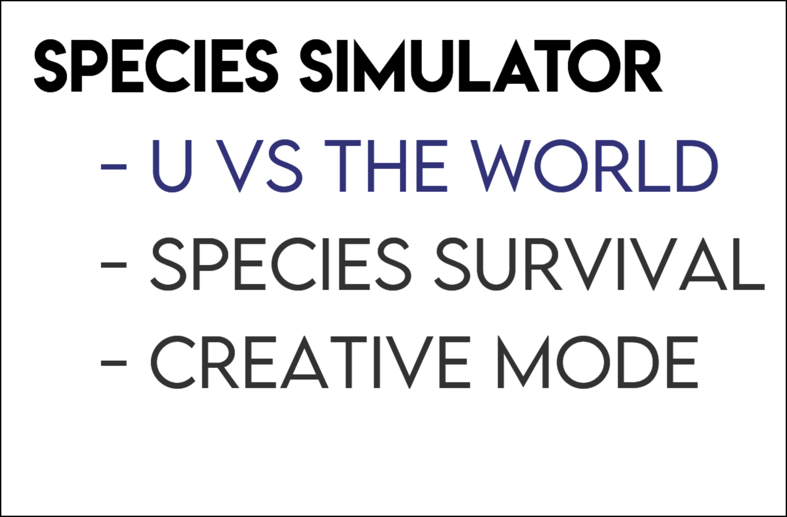
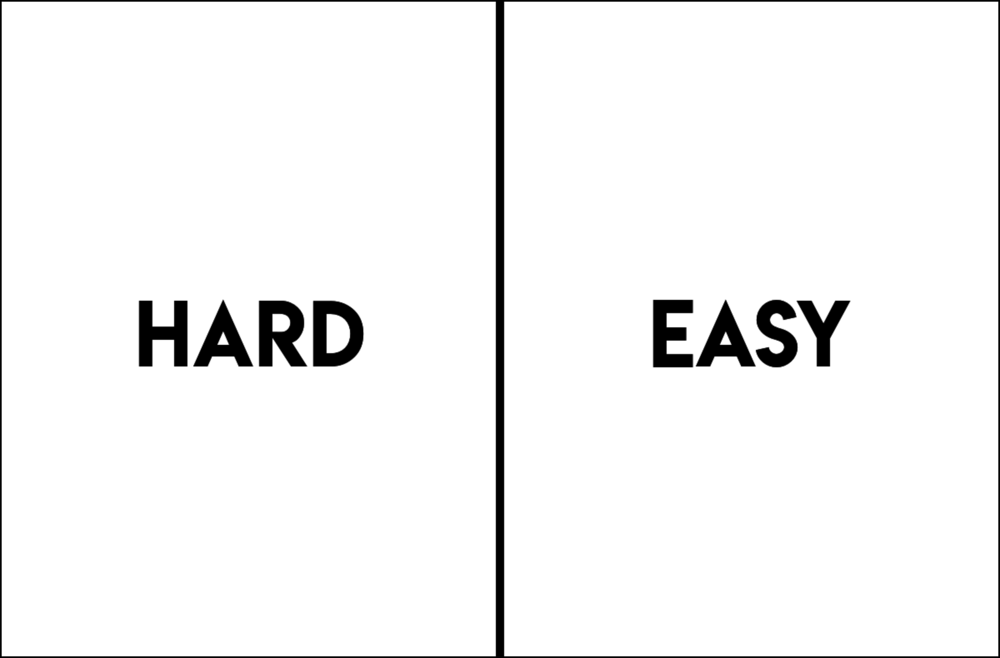

# User Manual

### How to Start Program / Instilation Instructions

1.Ensure Pygame and Python3 are isntalled (type "pip3 install python3", and "pip3 install pygame" into the terminal cosole)
2. CD to directiory
3. type and enter "python3 sim.py"
4. Enjoy!

### Poping! Software Solutions

Loading screen for the program. *Company* logo fades in and out. Skippable by pressing the 'c' key.

### Begin

A simple begin button. Click to progress to main menu and launch the programm.

### Main Menu

Main Menu containing three game mode options. Click on option to leach game mode of choice. U vs World allows for you to control a single member of a species and compete agains different members in either a hard or easy mode for the goly of last man standing. Species Survival allows for you to control the workings of a whole species and try to keep them allive. Creative Mode is the same as Species Survival but with no limitations on the speed of species development.

### Namer and DNA Configuration

On Screen promts guide the user to completing the naming process. Just Type. DNA configuration offers a back button to change name and a confirm button to continue, both are usable by clicking on the buttons. Simply drag and drop the desierd DNA genomes onto the allowed slots. Simple genome descriptions are offered by hovering over them.

### Difficulty Selection (U vs World)

Select hard or easy mode by clicking on your desired outcome. Hard mode will only let you see what your member sees, and easy mode will allow you too see the whole map.

### U vs World (Hard)

This game mode is the prime mode of this application. On the Left, the Member you control can be seen. You can only see what is in its sensory range and as such must look for food before its health runs out. Upgrades to attributes can be made with a click of the corresponding + button and will cost 1 food point. The game mode and species name can be seen in the top right. The remaining health and players can be seen in the bottom right. Use W, A, S and D to control the species. It is worth note to notice that more health will be used as you move around rather than stay still and that usage will increase as the speed rises. It is also worth note that *enemy* species will collect food and evolve, and they too will start with an option of 2 begining enhanced genomes out of memory, speed, sense and stamina.

### U vs World (Easy)

This game mode is the easier version fo the hard mode of U vs World. On the Left, the Member you control can be seen. You can see the whole world and suchmust look for food before your members health runs out. Upgrades to attributes can be made with a click of the corresponding + button and will cost 1 food point. The game mode and species name can be seen in the top right. The remaining health and players can be seen in the bottom right. Use W, A, S and D to control the species. It is worth note to notice that more health will be used as you move around rather than stay still and that usage will increase as the speed rises. It is also worth note that *enemy* species will collect food and evolve, and they too will start with an option of 2 begining enhanced genomes out of memory, speed, sense and stamina.

### Species Survival

Your species can be seen on the left and can be made to move around and search for food with the self-move toggle in the bottom left, below the remaining members indicator. Upgrades to attributes can be made with a click of the corresponding + button and will cost 1 food point. The game mode and species name can be seen in the top right. It is worth note to notice that more health will be used as your species move around rather than stay still and that usage will increase as the speed rises.

### Creative Mode

Your species can be seen on the left and can be made to move around and search for food with the self-move toggle in the bottom left, below the remaining members indicator. Upgrades to attributes can be made with a click of the corresponding + button and will not cost any food points. The game mode and species name can be seen in the top right. It is worth note to notice that more health will be used as your species move around rather than stay still and that usage will increase as the speed rises.

### Game OVer

The Game Over screen is displayed when either your entire species (species survival and creative mode) dies, your member dies (U vs World) or you are the last member allive (U vs World). Press escape to close the application.