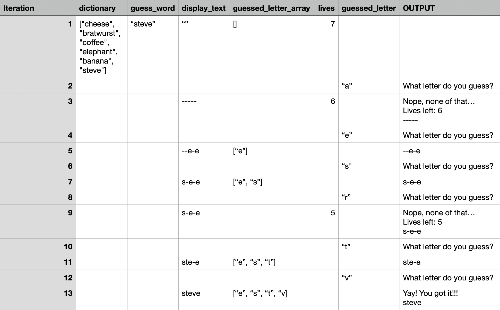

## Report on Pyhton Terminal Hangman

This intentionally basic python terminal hangman effectivly meets its intention as it provides basic and simple terminal comands. The code is variable based which is to be expected with this type of program and uses the variables to moderate progress and determine the course of the game. The pyhton random library is utilised effectivly in providing an optimum way of being assigned a word from a random list to guess. The program functions at its minimum and in an efficient manor as evedent by the attached desk check. Issues can however be found. Initially, the length of word is not shown to the player until after the first guess. This can be remedied through a simple block of code as shown below just before while loop in line 10.

```
for l in guess_word:
	display_text = display_text + "-"
print(display_text)

```

Further, in line 28, it is unnescasary to have "<=" when "<" would suffice, however no harm is done by using the "<=". A more comprehensive dictionary could perhaps be used. Such a task could be accomplished with an adjoinging file that is read in which contains a list of all words in the dictionary (such a file can be accessed online for free and with no copyright infringment). Finally, the use of the terminal command to clear the terminal will provide a more clean and readable user experience. In the current iteration of the program, the terminal piles up with every output to the terminal such as to a point where (as per the test data used in the desk check), the terminal would end up looking as below.

```
What letter do you guess? a
Nope, none of that…

Lives left: 6

-----
What letter do you guess?
--e-e
What letter do you guess?
s-e-e
What letter do you guess?
Nope, none of that…

Lives left: 5

s-e-e
What letter do you guess?
ste-e
What letter do you guess?
Yay! You got it!!!

steve

```

To remedy this, the systems clear funtionality inbuilt into the terminal can be used. This functionality adds a line of blank data to the terminal until the user sees a clearn terminal window. For MacOS, this can be achieved as below.

```
import os				## at the begining of the file
os.system("clear")		## whenever the terminal is wished to be cleared
```

Equivelants for windows can be found online and a simple if statment testing for if the OS is Mac or Windows followed by the function will allow for the cleaner interface.

#### Desk Check

